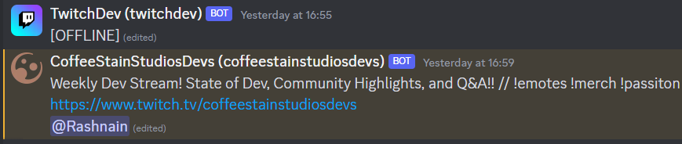

# Twitch

A bot that display and notify when chosen Twitch channels are live streaming.

It uses a webhook to display channels and their title in a fancy way, as show in the [exemple](#Example).

/!\ As the character limit for message is 2000, it may break if a lot of people use it (80+).

### Dependencies

You can install the needed packages by doing `pip install -r requirements.txt`.

### Secrets

You will have to write 5 secrets in the `.env` file :

* Your Discord bot token, which can be found on your bot [dashboard](https://discord.com/developers/applications) (`DISCORD_BOT_TOKEN`)
* Your Twitch app ID and secret, which can be found on your app [console](https://dev.twitch.tv/console/apps) (`TWITCH_APP_ID` and `TWITCH_APP_SECRET`)
* Your Discord webhook ID and token, which can be found on your server's integrations page (`DISCORD_WEBHOOK_ID` and `DISCORD_WEBHOOK_TOKEN`)

### Commands

`/subscribe <channel_login>` subscribe to a Twitch channel.

`/unsubscribe <channel_login>` unsubscribe from a Twitch channel.

`/unsubscribe_from_all` unsubscribe from all Twitch channel.

`/search <query>` show the 10 most relevent Twitch channel.

### Example

